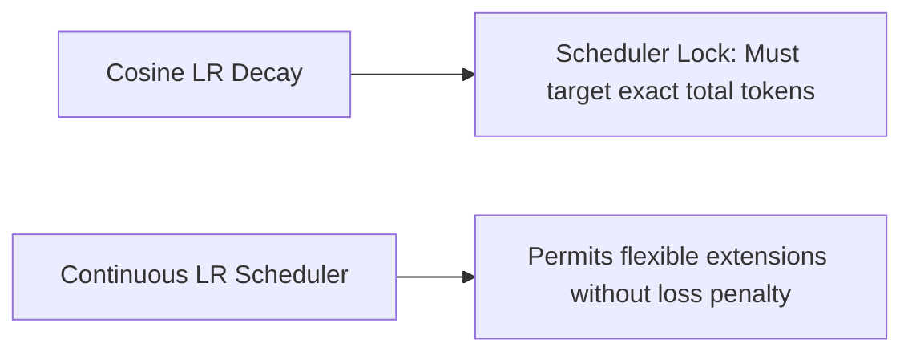

# The Learning Rate Decay Alignment Scheduler Lock

## Overview
Standard cosine learning rate schedules must decay to match the target token destination exactly. Aborting or extending runs midway leads to sub-optimal convergence.

## Diagram

[← Back to README](../README.md)
