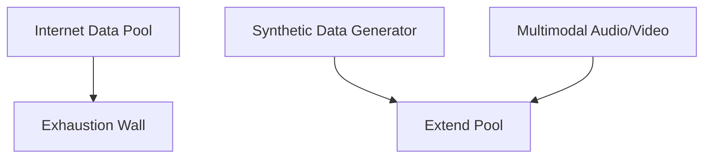

# The Data Wall Constraint (Token Exhaustion)

## Overview
Human-generated high-quality text data is finite. Scaling laws demand tens of trillions of tokens, hitting the "data wall."

## Mitigations
- Synthetic data generation pipelines.
- Multi-modal (video, audio) data ingestion.

## Diagram

[← Back to README](../README.md)
