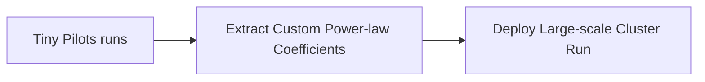

# Pre-Training Frontier Foundation LLM Suites (Llama / DeepSeek)

## Overview
Production implementation of scaling laws to calibrate huge cluster training allocations. Standardized runs utilize scaling equations to guarantee optimal return on investment.

## Diagram

[← Back to README](../README.md)
