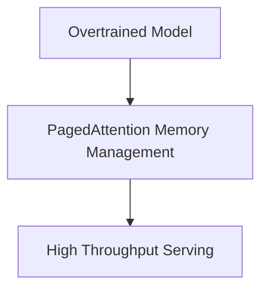

# High-Throughput Inference-Optimized Serving (vLLM Deployments)

## Overview
Deploying overtrained models maximizes serving throughput, using techniques like PagedAttention to maintain high serving concurrency under constraints.

## Diagram

[← Back to README](../README.md)
