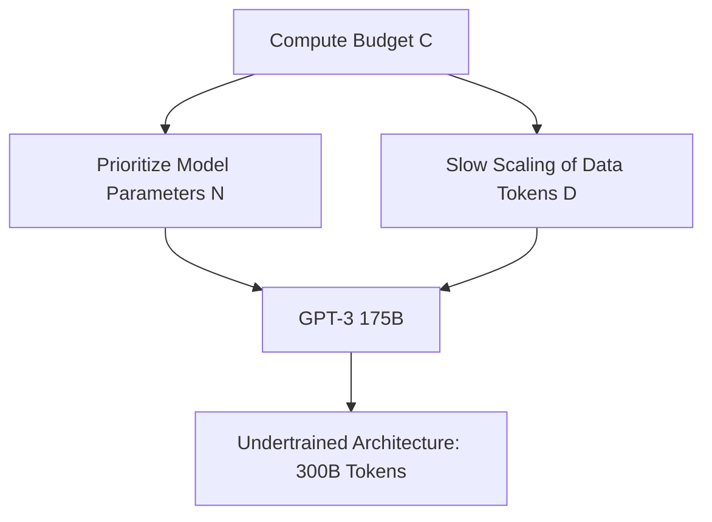

# The Parameter-Dominant Era (Kaplan / OpenAI Scaling Laws, 2020)

## Overview
In early 2020, Kaplan et al. published the foundational paper "Scaling Laws for Neural Language Models," suggesting that model parameter size ($N$) should be scaled much faster than the volume of training tokens ($D$). This led to a trend of training extremely large but undertrained models.

## Mathematical Formulation
The cross-entropy loss $L$ is modeled as:
$$L(N) \approx \left(\frac{N_c}{N}\right)^{\alpha_N}$$
where model size $N$ dominates performance improvements under compute limits.

## Diagram

[← Back to README](../README.md)
