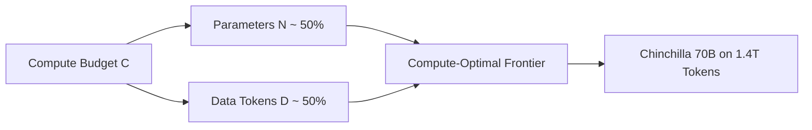

# The Equal-Scaling Revolution (Chinchilla Scaling Laws, 2022)

## Overview
Hoffmann et al. (2022) demonstrated that parameters ($N$) and data tokens ($D$) should be scaled in equal proportions (1:1). For optimal performance, a model requires roughly 20 tokens per parameter.

## Mathematical Formulation
$$N \propto C^{0.5}, \quad D \propto C^{0.5}$$
With optimal coefficients:
$$G \approx 20 \text{ tokens/parameter}$$

## Diagram

[← Back to README](../README.md)
