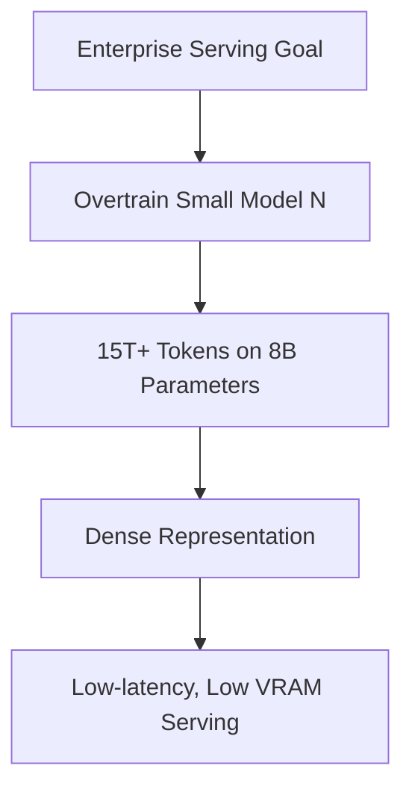

# The Inference-Optimal Overtraining Era (~2024–Present)

## Overview
Focuses on minimizing lifetime serving/inference costs rather than training compute. By overtraining small parameter models on massive token counts, inference costs and latency are dramatically reduced.

## Trade-off Analysis
* **Training Cost:** Higher (trained far past compute-optimal limit).
* **Inference Cost:** Lower (compact footprint, faster generation).

## Diagram

[← Back to README](../README.md)
