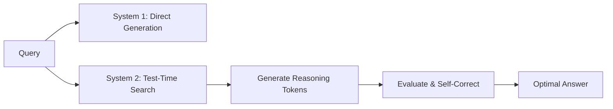

# The Test-Time Compute Scaling Era (~2025–Present)

## Overview
Instead of scaling static pre-training limits, test-time scaling allocates more compute at inference. Using search, rollouts, and verification (System 2 thinking), accuracy scales with reasoning tokens generated at inference.

## Methods
1. **Search & Rollouts:** MCTS, Best-of-N sampling.
2. **Self-Correction:** Multi-turn verification.

## Diagram

[← Back to README](../README.md)
