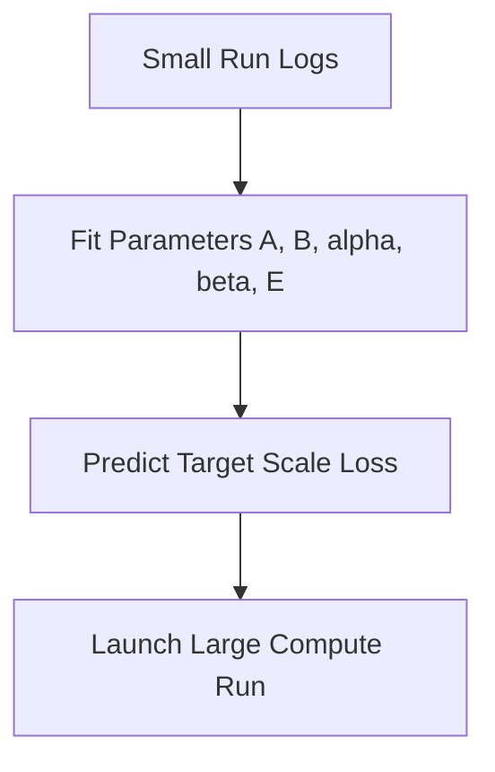

# Parametric Loss Power-Law Modeling

## Overview
Models the cross-entropy loss ($L$) as a power-law function of parameters ($N$) and data ($D$). This is used to forecast scale before expensive training runs.

## Mathematical Formulation
$$L(N, D) = \frac{A}{N^\alpha} + \frac{B}{D^\beta} + E$$

## Diagram

[← Back to README](../README.md)
