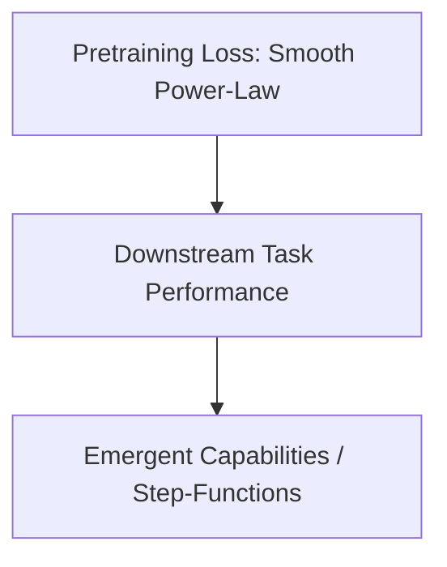

# Downstream Capability Alignment Scaling

## Overview
Evaluates scaling laws against actual downstream capabilities (e.g. coding, math tasks) instead of upstream cross-entropy loss, which often shows step-function breakthroughs.

## Diagram

[← Back to README](../README.md)
