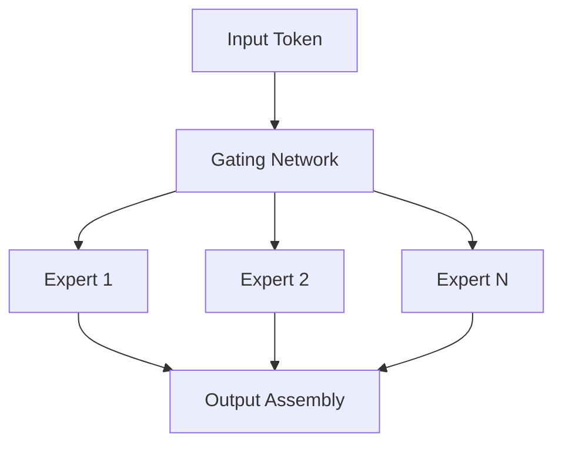

# Mixture-of-Experts (MoE) Scaling Optimization

## Overview
Decouples total capacity (parameters) from active computation. By routing tokens to subset experts, MoE achieves high capacity with low training compute.

## Diagram

[← Back to README](../README.md)
